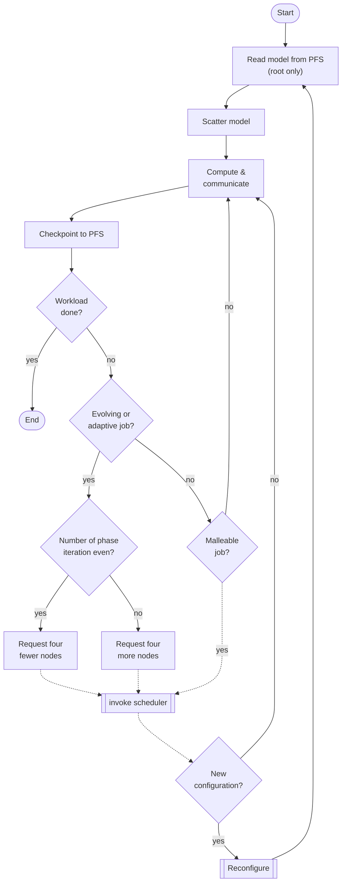

# Quickstart

The easiest way to get started with ElastiSim is by cloning the example project available on [GitHub](https://github.com/elastisim/example-project). This scenario simulates an FCFS (first come, first serve) scheduling algorithm applied on 500 jobs—including all job types—with alternating compute and I/O phases (see [Application model](#application-model)) running on a crossbar topology with 128 compute nodes. While evolving and adaptive jobs request a new configuration at the beginning of each iteration of the specified phase, malleable jobs accept any reconfiguration. The scheduler accepts all evolving requests that shrink the job but accepts evolving requests to expand the job only to a maximum of available nodes. For malleable jobs, the scheduler expands to the highest possible number of nodes based on the number of available nodes. The following steps will create a Docker container including all the required libraries for ElastiSim and start the simulation.

## Installation

To build the container required to run ElastiSim, install Docker and execute the following command:
```sh
docker build -t elastisim .
```

## Simulation

To run the simulation, execute the following commands in two different sessions:

### Linux:
```sh
docker run -v $PWD/data:/data -v $PWD/algorithm:/algorithm -u `id -u $USER` --name elastisim -it --rm elastisim /data/input/configuration.json --log=root.thresh:warning
docker exec -u `id -u $USER` -it elastisim python3 /algorithm/algorithm.py
```

### Mac OS:
```sh
docker run -v $PWD/data:/data -v $PWD/algorithm:/algorithm --name elastisim -it --rm elastisim /data/input/configuration.json --log=root.thresh:warning
docker exec -it elastisim python3 /algorithm/algorithm.py
```

### Windows (PowerShell):
```sh
docker run -v ${PWD}\data:/data -v ${PWD}\algorithm:/algorithm --name elastisim -it --rm elastisim /data/input/configuration.json --log=root.thresh:warning
docker exec -it elastisim python3 /algorithm/algorithm.py
```

The first command runs the ElastiSim simulator process and accepts two inputs:
- the configuration file (JSON)
- the logging level

For a more detailed output, change `--log=root.thresh:warning` to `--log=root.thresh:info` (caution: verbose).

The second command runs the scheduling algorithm.

# Application model

The following flowchart visualizes the application model used in the example project.



{: .note }
Communicating with the scheduler is the runtime's responsibility and is not controlled by the application model (represented with dotted links).
