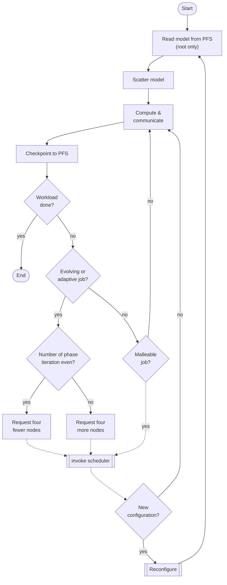

# Quickstart

The easiest way to get started with ElastiSim is to use the [Dev Containers](https://github.com/elastisim/elastisim-devcontainer) we provide on GitHub. Dev Containers are containerized development environments native to VSCode. We provide all necessary setup files that automatically install required libraries and dependencies within a Docker container, facilitating rapid development. To learn more about Dev Containers, please visit the official [Dev Container documentation](https://code.visualstudio.com/docs/devcontainers/containers).

We provide two flavors of Dev Containers for 1) users and 2) contributors. The user Dev Container builds the environment for developing custom scheduling algorithms using the ElastiSim simulation engine and the Python interface. After the setup, the container automatically clones the [example project](https://github.com/elastisim/example-project), enabling users to experiment immediately. In contrast, the contributor Dev Container targets developers contributing to the ElastiSim project and additionally includes the source code for both projects, the [simulation engine](https://github.com/elastisim/elastisim), and the [Python interface](https://github.com/elastisim/elastisim-python). Both Dev Containers provide all necessary settings, launch, and build files to run the experiment or compile the project immediately. If you use ElastiSim to develop and evaluate custom schedulers, we strongly advise using the user container, as it focuses on a minimal build and performance.

The scenario in the example project simulates an FCFS (first-come, first-serve) scheduling algorithm applied to 500 jobs—including all job types—with alternating compute and I/O phases (see [Application model](#application-model)) running on a crossbar topology with 128 compute nodes. While evolving and adaptive jobs request a new configuration at the beginning of each iteration of the specified phase, malleable jobs accept any reconfiguration. The scheduler accepts all evolving requests that shrink the job, but accepts evolving requests to expand the job only up to the maximum number of available nodes. For malleable jobs, the scheduler expands to the highest possible number of nodes based on the number of available nodes.

## Installation

To build the Dev Container, clone [elastisim-devcontainer](https://github.com/elastisim/elastisim-devcontainer) and open the folder in VSCode, where you will see a notification that the repository contains Dev Container files. Open the repository in the container and choose _ElastiSim User_ or _Contributor_, respectively. The container will now build automatically and set up all necessary files.

## Simulation

To run the simulation, execute the _Run ElastiSim Scenario_ from the _Run and Debug_ panel. If you are using the contributor Dev Container, you must build the project first using the CMake configuration files provided by the container.

For a more detailed output, change the arguments of the simulation engine from `--log=root.thresh:warning` to `--log=root.thresh:info` in the launch.json file under the .vscode folder (caution: verbose).

# Application model

The following flowchart visualizes the application model used in the example project.

```mermaid
flowchart TD
    Start([Start])
    Start --> Read["Read model from PFS<br>(root only)"]
    Read --> Scatter[Scatter model]
    Scatter --> Compute[Compute &<br>communicate]
    Compute --> Write[Checkpoint to PFS]
    Write --> WD{Workload<br>done?}
    WD -->|yes| Stop([End])
    WD -->|no| Evol{Evolving or<br>adaptive job?}
    Evol -->|yes| Even{Number of phase<br>iteration even?}
    Evol -->|no| Mall{Malleable<br>job?}
    Even -->|yes| Req_more[Request four<br>fewer nodes]
    Even -->|no| Req_fewer[Request four<br>more nodes]
    Req_more -.-> Inv
    Req_fewer -.-> Inv
    Mall -.->|yes| Inv
    Inv[[invoke scheduler]]
    Inv -.-> NC{New<br>configuration?}
    Mall -->|no| Compute
    NC -->|no| Compute
    NC -->|yes| Reconf[[Reconfigure]]
    Reconf --> Read
```

{: .note }
Communicating with the scheduler is the runtime's responsibility and is not controlled by the application model (represented with dotted links).
