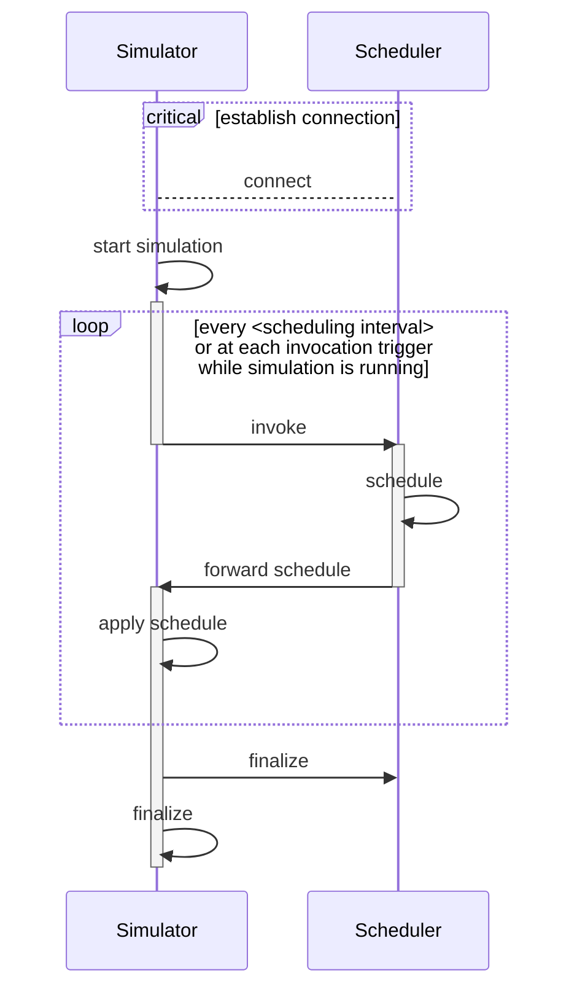

# Scheduling protocol

During simulations, the simulator and the scheduler process are in constant communication. The scheduling protocol defines *which* data the processes exchange *when*.

{: .note }
Do not confuse the scheduling protocol with the communication protocol. The scheduling protocol does **not** define *how* the data is exchanged.

ElastiSim periodically invokes the scheduling algorithm in a user-defined interval (see Configuration for additional options). Each invocation contains a list of all compute nodes, jobs, and a map holding system information. After the scheduling algorithm makes a scheduling decision, the scheduler process forwards the decision to the simulator process, applying the new schedule.

{: .important }
The entire simulation stops at invocation time and continues after the scheduling algorithm returns.

The following sequence diagram visualizes the scheduling protocol:

ElastiSim employs ZeroMQ to establish the connection and exchange data following the scheduling protocol. This design choice separates the concerns and allows ElastiSim to interface with any modern programming language. Users can develop scheduling algorithms in languages such as Python, while the entire simulation makes use of highly performant C++ routines. The [Scheduling interface](/scheduling-interface) section documents the details of exchanged data, all available interfaces, and their routines.
